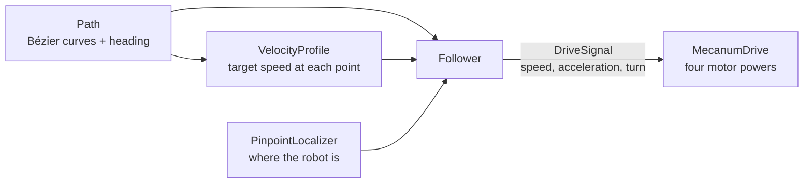

# Odyssey

Path following for FTC mecanum robots. You describe a path as smooth Bézier curves; Odyssey plans
how fast to drive along it (respecting acceleration, braking and how sharp the curves are) and
drives it with kS / kV / kA feedforward plus PID corrections, using a goBILDA Pinpoint for
odometry. It comes with a simulator that runs your OpModes on a model of the robot.

> **Status: early, and under active development on the [`test`](https://github.com/saquer916/odyssey/tree/test) branch.**
> The follower has been debugged and tuned in the simulator, but it hasn't been proven on a real
> robot or in competition yet, and it's missing features that mature libraries like
> [Pedro Pathing](https://pedropathing.com) have (see [Roadmap](#roadmap)). `main` still holds the
> original code, before those fixes — see [Branches](#branches).

## What's in this repo

| Folder | What it is |
|---|---|
| `odyssey-core/` | The library: geometry, Bézier paths, the velocity profile, the follower, PID. Plain Java with no FTC dependencies, so it's unit-tested on a computer. |
| `TeamCode/src/main/java/org/firstinspires/ftc/teamcode/odyssey/` | The robot side: `MecanumDrive` (turns the follower's output into motor powers), `PinpointLocalizer`, the goBILDA Pinpoint driver, and OpModes to test and tune with. |
| [`odyssey-sim/`](https://github.com/saquer916/odyssey/tree/test/odyssey-sim) (on `test`) | The simulator: give it an OpMode `.java` file and it runs it on a modeled robot, then reports where the robot went compared to the path. |
| `odyssey-gui/` | A small JavaFX tool for dragging a Bézier curve's control points over a picture of the field. |
| everything else | The FTC SDK project Odyssey lives in (SDK 11.1), plus other team code (an LED panel display, vision, the TRC library). The SDK's own README is in [doc/FTC_SDK_README.md](doc/FTC_SDK_README.md). |

## How it works



**Before the OpMode starts**, the `VelocityProfile` walks the whole path and works out the
fastest safe speed at every point: no faster than the max velocity, slow enough on curves that the
robot doesn't slide (the centripetal limit), and ramping up and down within the acceleration and
braking limits.

**Every loop:**

1. The localizer reads the robot's position and heading from the Pinpoint.
2. The follower finds the closest point on the path and how far along the path that is.
3. It looks up the target speed there. A minimum drive speed keeps the robot from stalling, since
   the plan starts and ends at zero.
4. It combines four things into one command:
   - drive along the path's direction at that speed;
   - a **translational PID** that pulls the robot back toward the path when it drifts sideways;
   - a **heading PID** that turns the robot toward the heading the path wants there;
   - **feedforward acceleration**: speeding up, braking, and the inward pull needed on curves.
5. `MecanumDrive` turns that into four wheel powers with `power = kS + kV·velocity + kA·acceleration`
   per wheel. It scales for battery voltage and, if any wheel would go over 1, scales all four down
   together so the robot keeps its direction.

**Paths.** A `BezierCurve` has four control points plus a heading interpolator: `ConstantInterpolator`,
`LinearInterpolator` (turn from one heading to another), `TangentInterpolator` (face where you're
going), or `FaceTargetInterpolator` (keep facing a point). A `Path` chains curves together.

**Units and directions.** Millimetres and radians, in the Pinpoint's frame: +X is forward, +Y is
left, and positive headings turn counter-clockwise. `resetPosAndIMU()` makes wherever the robot is
the origin.

## Using it in an OpMode

The robot needs four drive motors named `leftFront`, `rightFront`, `leftBack`, `rightBack` and a
Pinpoint named `localizer` in the robot configuration. A complete example is
[`SamplePath`](https://github.com/saquer916/odyssey/pull/7); the core of it is:

```java
// init()
GoBildaPinpointDriver pinpoint = hardwareMap.get(GoBildaPinpointDriver.class, "localizer");
pinpoint.resetPosAndIMU();
localizer = new PinpointLocalizer(pinpoint);

Path path = new Path(
        new BezierCurve(new Vector2d(0, 0), new Vector2d(200, 0),
                new Vector2d(400, 0), new Vector2d(600, 0), new ConstantInterpolator(0)),
        new BezierCurve(new Vector2d(600, 0), new Vector2d(850, 0),
                new Vector2d(1000, 150), new Vector2d(1000, 400), new LinearInterpolator(0, Math.PI / 2)));
VelocityProfile profile = new VelocityProfile(path, MAX_VELOCITY, MAX_ACCEL, MAX_BRAKE, MAX_CENTRIPETAL, 1.25);

PIDController translational = new PIDController(0, TRANSLATIONAL_kP, TRANSLATIONAL_kI, TRANSLATIONAL_kD);
translational.setOutputLimits(-TRANSLATIONAL_LIMIT, TRANSLATIONAL_LIMIT);
PIDController heading = new PIDController(0, HEADING_kP, HEADING_kI, HEADING_kD);
heading.setOutputLimits(-HEADING_LIMIT, HEADING_LIMIT);

follower = new Follower(path, localizer, profile, translational, heading, MIN_DRIVE_SPEED, FLOOR_CUTOFF);
drive = new MecanumDrive(kS, kV, kA, lX, lY, leftFront, rightFront, leftBack, rightBack, voltageSensor);

// start()
timer = new ElapsedTime();

// loop()
localizer.update();
drive.drive(follower.update(timer.seconds()));
```

## Setting up and tuning a robot

Do these in order; each one depends on the one before.

1. **`PushTest`.** Push the robot by hand and check the odometry: 1 m forward should read about
   1000 mm of X, pushing left should increase Y, and turning left should increase the heading.
2. **`Drive Sign Check`.** It drives forward, left and counter-clockwise for half a second each and
   should print three PASS lines. If one fails, motor directions or the mecanum mixing are wrong;
   fix that before anything else.
3. **`StaticCoefficientOpMode`, then `kAOpMode`.** These measure kS / kV and then kA. `kAOpMode`
   drives about 1.6 m, so give it room.
4. **Path gains.** Start from the constants in [`FirstTest` / `SamplePath`](https://github.com/saquer916/odyssey/pull/8),
   which were tuned in the simulator, and run `SamplePath` with plenty of space. If the robot
   shakes or oscillates, halve `TRANSLATIONAL_kP` and `TRANSLATIONAL_kI` first.

One rule to keep when changing the speed limits: `MIN_DRIVE_SPEED` must stay above
`(kA / kV) × MAX_BRAKE`, which is about `0.35 × MAX_BRAKE` on this robot. Below that, the braking
feedforward cancels the minimum speed near the end of a path, and the robot stops short.

## Simulator

[`odyssey-sim`](https://github.com/saquer916/odyssey/tree/test/odyssey-sim) runs a real OpMode file
against a model of the robot: DC motors with friction and braking, battery sag, weaker strafing, a
noisy Pinpoint, and loop timing that comes from the OpMode's own hardware calls. Its defaults are
calibrated to the kS / kV / kA measured on this robot.

```
./gradlew :odyssey-sim:run --args="TeamCode/src/main/java/org/firstinspires/ftc/teamcode/odyssey/opmodes/FirstTest.java"
```

It writes `odyssey-sim/out/<OpMode>/report.html` (the path vs where the robot went, plus speed,
wheel powers and battery over time) and `trace.csv`. Details are in
[odyssey-sim/README.md](https://github.com/saquer916/odyssey/blob/test/odyssey-sim/README.md).

**No computer set up for the robot?** A [GitHub Actions workflow](https://github.com/saquer916/odyssey/pull/6)
runs the tests and simulates every OpMode in `TeamCode/.../odyssey/opmodes/` on each push. Open the
**Actions** tab, click a run, and the summary shows how each OpMode did; the full reports are under
**Artifacts**.

## Branches

| Branch | What it's for |
|---|---|
| `main` | The stable version, and what this page shows. It moves forward only after `test` has been tried on the real robot. Right now it's behind: it still has the original code. |
| `test` | Where finished work comes together. Every pull request targets `test`; this is the branch to build and try. |
| `fix/…`, `docs/…`, `ci/…`, `tune/…`, `sample/…` | One change each. They're opened as a pull request into `test` and can be deleted once merged. |

The flow is: make a branch for one change → open a pull request into `test` → review (the
simulator runs on it) → merge into `test` → try it on the robot → merge `test` into `main`.

## Roadmap

Known limits, roughly in order of importance:

- **Real-robot testing.** Everything after the bug fixes has only been checked in the simulator.
- **Correction along the path.** The follower corrects sideways drift and heading, but nothing
  tracks *how far along* the path the robot should be. Reaching the end relies on the minimum
  drive speed rule above.
- **Speed.** The tuned max velocity is 890 mm/s (about 35 in/s); faster needs the item above.
- **Loop cost.** Each loop re-solves for the robot's position on the curve several times. It should
  be computed once.
- **Features teams expect:** chaining paths, actions partway along a path, holding a position, an
  "is the path done?" check, tuning OpModes in the library, more localizers, and drawing on a field
  dashboard.
- **Publishing** `odyssey-core` as a library (JitPack) so teams don't have to copy it in.

## Contributing

Help is very welcome, especially with the roadmap. See [CONTRIBUTING.md](.github/CONTRIBUTING.md).
Pull requests go into the `test` branch.

## Credits and licenses

- The **FTC SDK** (`FtcRobotController/`, the project's Gradle setup, the samples) is © FIRST, under
  the license in [LICENSE](LICENSE).
- The **goBILDA Pinpoint driver** (`GoBildaPinpointDriver.java`) is © Base 10 Assets, LLC, under the
  MIT License in its header.
- The **TRC library** (`TeamCode/.../trclib/`) is © Titan Robotics Club, under the MIT License in each
  file.
- `PIDController` is adapted from Charles Grassin's MIT-licensed PID controller. Its original
  copyright notice still needs to be added back to the file.
- Odyssey's own code doesn't have a license yet. Until it does, others can read it but can't
  legally reuse it.
